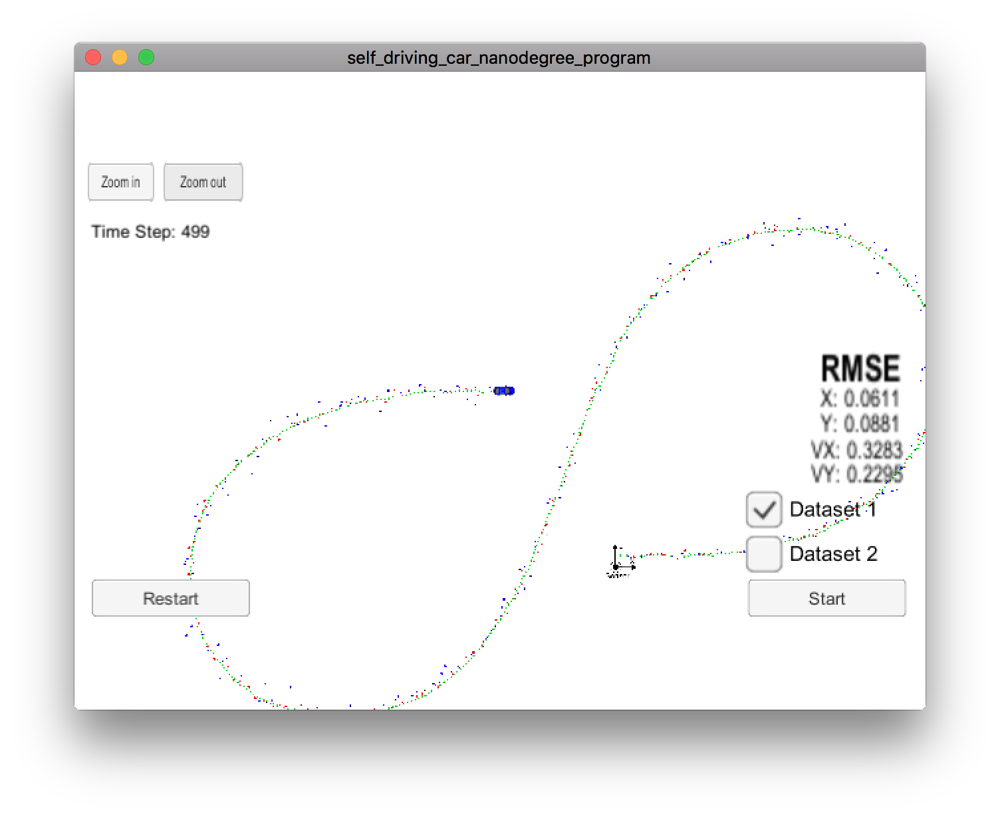
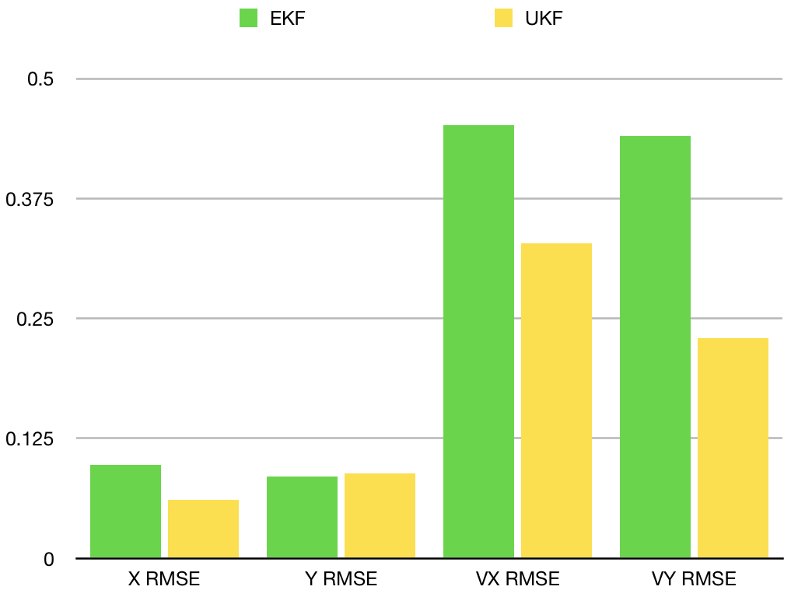
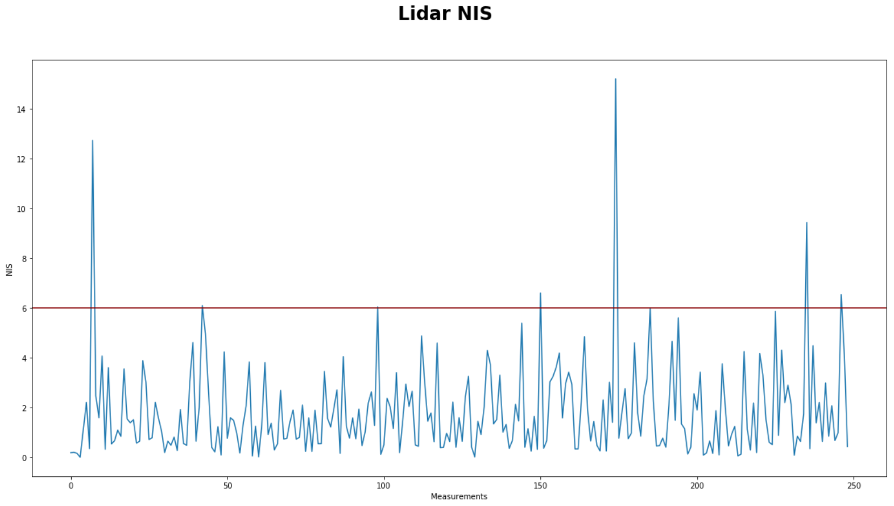

# Unscented Kalman Filter Project

Self-Driving Car Engineer Nanodegree Program

This project utilizes an Unscented Kalman Filter to estimate the state of a moving object of interest with noisy lidar and radar measurements.  

## Project Structure

Project structure has been kept the same as in the starter code.

Files [ukf.cpp](src/ukf.cpp) and [ukf.h](src/ukf.h) compute most of the steps of the UKF filter. Methods in the `UKF` have self-descriptive names that represent different steps of the UKF filter:

UKF entry point:
- `ProcessMeasurement`

Prediction steps:
- `GenerateSigmaPoints`
- `PredictSigmaPoints`
- `PredictMeanAndCovariance`

Update steps:
- `PredictRadarMeasurement` and `PredictLidarMeasurement`
- `UpdateLidar` and `UpdateRadar`

A helper function `NormalizeAngle` has been added to bring angle values to the range -π..+π.

`Tools::CalculateRMSE` has been implemented to compute RMSE.

## Process visualization

Process visualization provided by the simulator shows expected results: estimated track (green dots) is averaged from radar and lidar measurements (blue and red dots).

## Accuracy Comparison

Accuracy comparison between UKF and EKF is shown in the table and chart below.

| Algorithm  | X RMSE | Y RMSE | VX RMSE | VY RMSE |
|:----------:|:------:|:------:|:-------:|:-------:|
| UKF        | 0.0632 | 0.0920 | 0.3341  | 0.2379  |
| EKF        | 0.0973 | 0.0855 | 0.4513  | 0.4399  |

UKF provides better accuracy compared to EKF except 'Y RMSE' where EKF performed slightly better.

## Parameters Initialization

Initial values of `std_a_` and `std_yawdd_` have been changed from `30.0` to `0.3 both`. As has been confirmed by computing NIS metric, these initial values allow to make estimations with proper certainty.

## NIS

The project computes Normalized Innovations Squared (NIS) metric for radar and lidar measurements. [nis.cpp](src/nis.cpp) and [nis.h](src/nis.h) contain implementations of NIS metric. `UKF` class has two variables `nis_radar_` and `nis_lidar_` (lines 88-89 of ukf.h). Functions `UpdateLidar` and `UpdateRadar` call `nis_lidar_.Add` and `nis_radar_.Add` (lines 310 and 355 of ukf.cpp) to collect data at runtime.

The file `main.cpp` calls `WriteToFile` for both instances of `Nis` after having collected 249 lidar data samples — that's the number of lidar samples in the source file. `WriteToFile` exports collected data to [lidar.txt](nis_data/lidar.txt) and [radar.txt](nis_data/radar.txt) files.

Data is visualized in the notebook [plot_nis.ipynb](nis_data/plot_nis.ipynb). The notebook plots distribution of NIS metric across measurements. For laser measurements, a horizontal line at `y=5.991` is drawn. The constant was chosen from a table based on 2 degrees of freedome for laser measurements. For radar measurements, the line is drawn at `y=7.815` since radar has 3 degrees of freedom. For 5% of measurements NIS should be above the line.

The charts show that indeed, about 5% of measurements are above the line which confirms that the values of process noise constants were set correctly.

The chart for lidar NIS is shown below.

